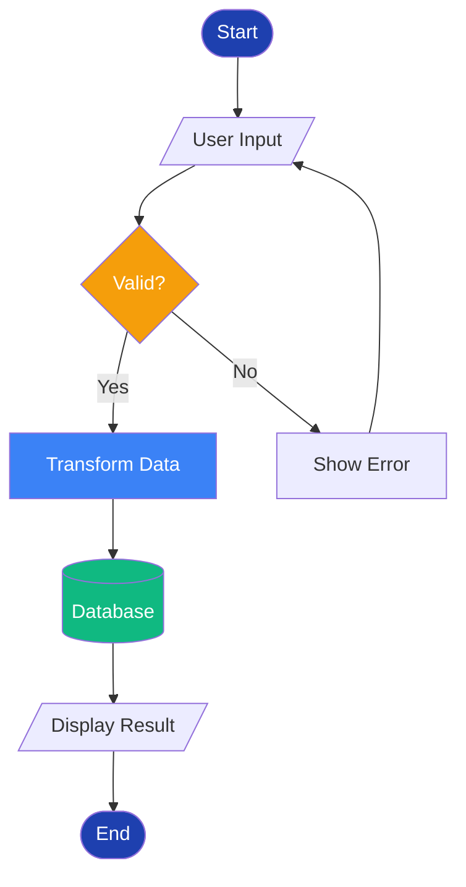
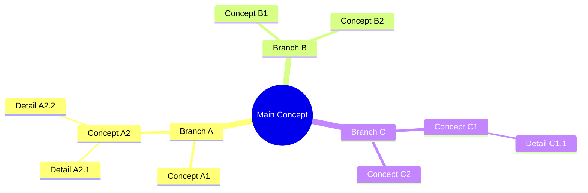
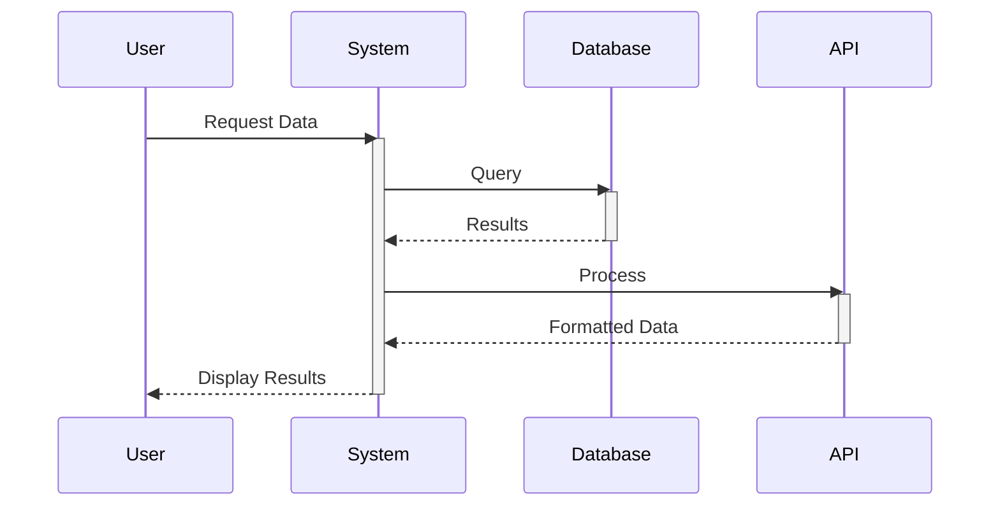
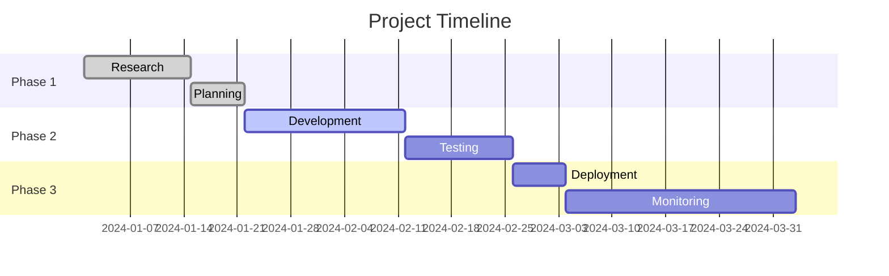
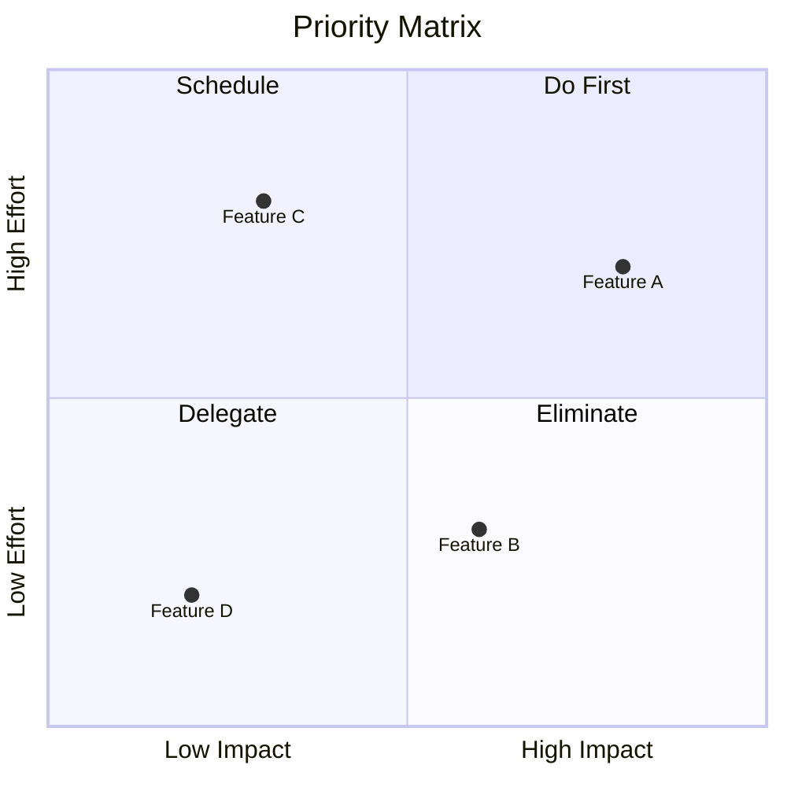

Create professional diagram for: $ARGUMENTS

## Diagram Creation Process

### Phase 1: Diagram Type Selection

Based on content analysis, select appropriate diagram:

```yaml
Diagram Type Guide:
  
  Flowchart:
    Use for: Processes, decisions, workflows
    Example: User journey, algorithm, procedure
    
  Sequence:
    Use for: Interactions, communications, protocols
    Example: API calls, user-system interaction
    
  Mindmap:
    Use for: Concepts, brainstorming, relationships
    Example: Topic breakdown, idea organization
    
  Gantt:
    Use for: Timelines, project phases, schedules
    Example: Roadmap, project timeline
    
  Pie:
    Use for: Proportions, distributions, parts of whole
    Example: Market share, budget allocation
    
  State:
    Use for: States, transitions, lifecycles
    Example: Order status, system states
    
  Journey:
    Use for: User experience, customer path
    Example: Customer lifecycle, user story
    
  ER Diagram:
    Use for: Data relationships, database schema
    Example: System architecture, data model
    
  C4:
    Use for: Software architecture, system context
    Example: System design, component relations
    
  Quadrant:
    Use for: 2x2 matrices, categorization
    Example: Priority matrix, SWOT analysis
```

### Phase 2: Diagram Syntax Generation

```javascript
// Use Mermaid MCP to get syntax examples
async function generateDiagramSyntax(type, content) {
  // Get diagram template
  const template = await mcp__mermaid__get_diagram(type);
  const examples = await mcp__mermaid__get_diagram_examples(type);
  
  // Generate custom syntax based on content
  return buildCustomDiagram(template, examples, content);
}
```

### Phase 3: Style Application

Apply presentation design system to diagram:

```mermaid
%%{init: {
  'theme': 'base',
  'themeVariables': {
    'primaryColor': '#1E40AF',
    'primaryTextColor': '#FFFFFF',
    'primaryBorderColor': '#1E3A8A',
    'lineColor': '#E5E7EB',
    'secondaryColor': '#F59E0B',
    'tertiaryColor': '#F9FAFB',
    'background': '#FFFFFF',
    'mainBkg': '#1E40AF',
    'secondBkg': '#F59E0B',
    'tertiaryBkg': '#F9FAFB',
    'primaryBorderColor': '#1E3A8A',
    'secondaryBorderColor': '#D97706',
    'tertiaryBorderColor': '#E5E7EB',
    'textColor': '#1F2937',
    'fontFamily': 'Inter, sans-serif',
    'fontSize': '16px',
    'labelBackground': '#FFFFFF',
    'actorBkg': '#1E40AF',
    'actorTextColor': '#FFFFFF',
    'nodeTextColor': '#FFFFFF',
    'nodeBorder': '#1E3A8A',
    'clusterBkg': '#F9FAFB',
    'clusterBorder': '#E5E7EB',
    'edgeLabelBackground': '#FFFFFF',
    'edgeLabelColor': '#1F2937'
  }
}}%%
```

### Phase 4: Diagram Examples

#### 1. Process Flowchart


#### 2. Mindmap


#### 3. Sequence Diagram


#### 4. Gantt Chart


#### 5. Quadrant Chart


### Phase 5: Diagram Rendering

```python
def render_diagram_for_slide(mermaid_code, design_system):
    """
    Render Mermaid diagram with design system
    """
    
    # Apply theme variables
    themed_code = apply_theme_to_mermaid(
        mermaid_code,
        design_system['colors'],
        design_system['fonts']
    )
    
    # Generate diagram image
    diagram_path = generate_diagram_image(
        themed_code,
        format='png',
        background='transparent',
        scale=2  # High DPI
    )
    
    # Optimize for presentation
    optimized = optimize_diagram_image(
        diagram_path,
        target_width=1600,
        target_height=900,
        maintain_aspect=True
    )
    
    return optimized
```

### Phase 6: Integration with Slides

```python
def add_diagram_to_presentation(presentation, slide_index, diagram_spec):
    """
    Add diagram to specific slide
    """
    
    # Generate diagram
    diagram_code = create_mermaid_code(diagram_spec)
    
    # Render to image
    diagram_image = render_diagram_for_slide(
        diagram_code,
        get_design_system()
    )
    
    # Add to slide
    mcp__pptx__add_image_to_slide(
        presentation_name=presentation,
        slide_index=slide_index,
        image_path=diagram_image,
        left=calculate_center_x(diagram_image),
        top=calculate_center_y(diagram_image),
        width=get_optimal_width(diagram_image),
        height=get_optimal_height(diagram_image)
    )
    
    # Add caption if needed
    if diagram_spec.get('caption'):
        add_diagram_caption(
            presentation,
            slide_index,
            diagram_spec['caption']
        )
```

## Diagram Best Practices

### Content Guidelines
```yaml
Best Practices:
  Simplicity:
    - Maximum 7±2 elements per diagram
    - Clear labels (2-4 words)
    - Logical flow direction
    - Consistent shapes
  
  Clarity:
    - High contrast colors
    - Adequate spacing
    - Clear connectors
    - Readable fonts
  
  Purpose:
    - Single concept per diagram
    - Support slide message
    - Add value, not decoration
    - Guide eye movement
```

### Common Patterns

```yaml
Patterns:
  
  Three-Step Process:
    Input → Process → Output
    
  Decision Tree:
    Question → Yes/No → Outcomes
    
  Cycle:
    Step1 → Step2 → Step3 → Step1
    
  Hierarchy:
    Top Level → Mid Level → Detail Level
    
  Comparison:
    Option A | Option B | Option C
    
  Timeline:
    Past → Present → Future
    
  Relationship:
    Central Node ← → Related Nodes
```

## Output Format

```markdown
# Diagram Created: [Type]

## Diagram Specification
- **Type**: Flowchart
- **Purpose**: Show user journey
- **Elements**: 8 nodes, 10 connections
- **Color Scheme**: Brand primary + accent

## Mermaid Code
\```mermaid
[Generated Mermaid code]
\```

## Rendered Image
- **Path**: exports/diagrams/diagram_01.png
- **Dimensions**: 1600x900px
- **Format**: PNG with transparency
- **File Size**: 145KB

## Integration Instructions
1. Slide 4: User Journey
   - Position: Center
   - Size: 80% of slide width
   - Caption: "Typical user path through system"

## Accessibility
- Alt text: "Flowchart showing 5-step user journey from registration to completion"
- Color blind safe: ✓
- Contrast ratio: 5.2:1

## Variations Available
1. Simplified (5 nodes)
2. Detailed (12 nodes)
3. Horizontal layout
4. Vertical layout
```

## Success Metrics
- [ ] Diagram supports slide message
- [ ] Clear and readable
- [ ] Brand colors applied
- [ ] Under 10 elements
- [ ] High contrast maintained
- [ ] Exports successfully
- [ ] Integrates with slide

## 🎯 Next Steps

### Recommended Next Action:
**Command**: Return to `/slide-build`
- **Purpose**: Continue building presentation with diagram
- **Why Now**: Diagram ready for integration
- **Expected Time**: Immediate

### Alternative Actions:

1. **Create Another Diagram?**
   ```
   /slide-diagram "[different concept]"
   ```
   - Use when: Multiple diagrams needed
   - Benefit: Batch creation more efficient

2. **Refine This Diagram?**
   ```
   /slide-diagram "[same concept] --style [variant]"
   ```
   - Use when: Need different visualization
   - Options: flowchart, mindmap, sequence, etc.

3. **Export Standalone?**
   ```
   Export diagram as PNG/SVG
   ```
   - Use when: Need for documentation
   - Formats: PNG (raster), SVG (vector)

### Integration Workflow:
```
✅ Diagram Created
→  Return to Build
   OR
→  Create More Diagrams
   THEN
→  Continue to Review
```

### Before Integration:
- [ ] Diagram complexity appropriate (≤9 elements)
- [ ] Colors match presentation design system
- [ ] Text is readable at slide size
- [ ] Message aligns with slide content
- [ ] Alternative text prepared

### 💡 Pro Tips:
- Keep diagrams simple - details in speaker notes
- Use consistent diagram style throughout presentation
- Consider animated build for complex diagrams
- Create simplified and detailed versions
- Test readability from back of room